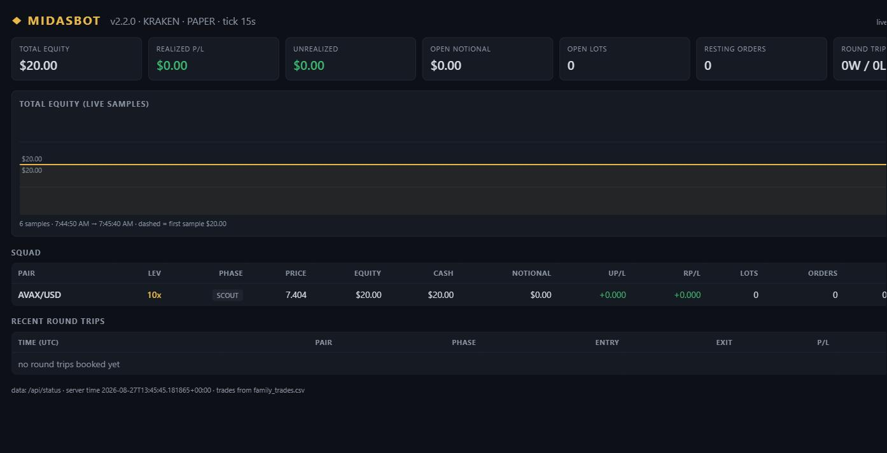

# MidasBot v2.3 — Full Squad, Single Brain

A multi-pair, multi-phase cryptocurrency **paper-trading** bot for Kraken,
with leveraged margin simulation, a real fill engine, a dark-mode live
dashboard, backtesting, and walk-forward parameter search — in one Python file.




## Scope — read this first

- **Paper trading only.** Live order execution is not implemented; `--live`
  always falls back to paper. No API keys required — everything runs on
  Kraken's public REST API.
- **Long positions only** (no shorting). Sells only ever close held inventory.
- **Leveraged margin simulation** — each pair trades at Kraken's catalog max
  leverage by default, with margin open fees, rollover, and forced
  liquidation modeled. `--leverage N` overrides; `--leverage 1` = spot.
- **Honest books.** Resting limit orders fill only when a real candle's
  high/low crosses them. Losses, liquidations, sunk fees, and rollover are
  all counted — the P/L log is measurement, not fiction.

## Quick start

```
pip install ccxt python-dotenv pyyaml
python MidasBot_Full.py --pairs all --budget 160
```

That launches all 16 catalog pairs ($10 margin each), serves the dashboard
at `http://127.0.0.1:8901`, and opens it in your browser. Single pair:

```
python MidasBot_Full.py --pair BTC/USD --budget 50
```

(Windows: `python`. Linux/macOS/Pydroid3: `python3`.)

## The brain

Every tick the bot classifies the market from EMA(12/48) slope, RSI(14),
and ATR%. Phase switches require `--hyst` consecutive agreeing ticks:

| Phase | Regime | Behavior |
|-------|--------|----------|
| SCOUT | no edge | stand aside, cancel resting entries |
| LUNCHBOX | flat + quiet | mean-revert grid of buy levels |
| REGULAR | flat + volatile | balanced grid |
| AFTERBURNER | trending up | momentum entry at touch, TP at 1.5× spacing |
| DIP | oversold, not crashing | pullback DCA buys |

Every filled lot gets a take-profit (one spacing step) and an optional stop
(`--stop-mult` × spacing below entry). At leverage, a lot whose loss reaches
80% of its margin is force-closed and booked as `LIQ`.

## Pair catalog (Kraken margin, max leverage)

`--pairs "AVAX/USD,LTC/USD"` runs one brain per pair (budget split evenly,
per-pair state files, shared trade log); `--pairs all` runs the full catalog.
The tick auto-slows with pair count to respect API rate limits.

| Pair | Lev | | Pair | Lev | | Pair | Lev | | Pair | Lev |
|------|-----|-|------|-----|-|------|-----|-|------|-----|
| AVAX | 10x | | UNI | 5x | | SHIB | 5x | | HBAR | 5x |
| LTC | 10x | | CRV | 5x | | TRX | 5x | | PEPE | 5x |
| USDC | 10x | | AAVE | 5x | | BCH | 5x | | ALGO | 5x |
| WLD | 3x | | NEAR | 5x | | DOT | 5x | | RENDER | 5x |

Position notional = margin × leverage; fees are charged on notional, plus a
0.02% margin open fee and 0.02%/4h rollover. `net_pct` in the trade log is
**return on margin**.

## Dashboard

Dark-mode web UI served by the bot itself (`--web PORT`, default 8901;
`--no-open` to skip the browser launch). Totals cards, a live total-equity
chart (10s samples, session-start baseline, crosshair tooltip), per-pair
table (leverage, phase, price, equity, notional, uP/L, rP/L, drawdown), and
recent round trips with liquidations highlighted. Built not to lie: every
pair shows its data age and flags **STALE** rather than freezing numbers,
unmeasured prices show `--` rather than 0, and a dead bot reads
**DISCONNECTED** instead of pretending.

## Measurement

```
python MidasBot_Full.py --pairs all --budget 160 --backtest 7
python MidasBot_Full.py --pairs "AVAX/USD,PEPE/USD" --budget 40 --sweep 7
python MidasBot_Full.py --report family_trades.csv
```

- **`--backtest DAYS`** replays real Kraken candles through the *exact* live
  brain — same regimes, fills, leverage, fees, rollover, liquidation — and
  prints per-pair results, regime occupancy, and a per-phase expectancy
  table. Writes `backtest_trades.csv`; never touches live state.
- **`--sweep DAYS`** maps the parameter space: every spacing (0.5–2%) ×
  stop (2/3/6/off) × leverage (1x, catalog max) combo is ranked on the first
  70% of history, then the top 3 re-run on the unseen last 30%. Verdicts:
  **HELD UP**, **OVERFIT**, or **UNVALIDATED**. In-sample rank alone is
  curve fitting; even a holdout pass only means "survived once". Picking
  parameters remains the operator's call.
- **`--report [CSV]`** prints win%, avg win/loss, profit factor, and
  expectancy per trade, grouped by pair and phase, from any trade log.

## Fee viability

A grid round trip books one spacing step. At Kraken's 0.25% maker fee the
**default 0.5% spacing cannot clear round-trip costs** — the startup banner
shows exactly which phases are viable at your settings, and sweep results
consistently favor 1.2–2% spacing. Widen `--spacing` (or override fees with
`--maker`/`--taker` if your tier is better) before expecting activity.

## Flags

| Flag | Description | Default |
|------|-------------|---------|
| `--pair` | Single trading pair | BTC/USD |
| `--pairs` | Comma-separated list, or `all` for the catalog | — |
| `--budget` | Total margin budget (split across pairs) | 50 |
| `--leverage` | Override leverage, 1 = spot | catalog max |
| `--grids` | Grid levels per pair | 8 |
| `--spacing` | Level spacing as fraction | 0.005 |
| `--stop-mult` | Stop = mult × spacing below entry (0 disables) | 3.0 |
| `--min-net` | Min net step after fees for a phase to trade | 0.002 |
| `--hyst` | Consecutive ticks to switch phase | 3 |
| `--tick` | Loop seconds (auto-slows in multi-pair) | 15 |
| `--web` / `--no-open` | Dashboard port (0 off) / don't open browser | 8901 |
| `--state` / `--fresh` | State file path / discard saved state | midas_state.json |
| `--log` / `--equity-log` | Trade log / equity curve CSV | family_trades.csv |
| `--backtest DAYS` | Historical replay, then exit | off |
| `--sweep DAYS` | Walk-forward parameter search, then exit | off |
| `--report [CSV]` | Expectancy report, then exit | off |
| `--config` | YAML overriding any of the above | — |
| `--dryrun` | One tick, then exit | false |

## Persistence

State (cash, lots, resting orders, realized P/L) is saved atomically every
tick to `midas_state.json` (per-pair files in multi-pair mode) and restored
on restart — a restart never wipes the book. `--fresh` starts over. Trades
append to `family_trades.csv`; equity marks to `equity_curve.csv`.

## ⚠️ Disclaimer

For education and strategy research. Paper results — including leveraged
paper results — do not predict live performance. Backtests are historical
replay, not prediction.

## License

MIT — see [LICENSE](LICENSE).
